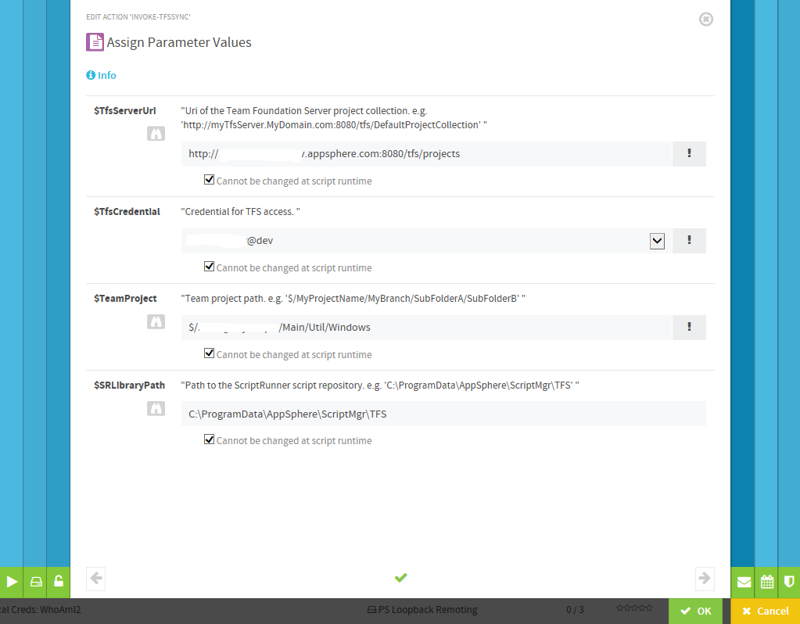

# Sync TFS projects to ScriptRunner

You can use the [Invoke-TfsSync.ps1](./Invoke-TfsSync.ps1) script to sync the latest version of a project folder from a Team Foundation Server project collection.
The script requires the TFS Power Tools. You can download the Tools from the [Visual Studio Marketplace](https://marketplace.visualstudio.com).

## Required Script Parameters

- TfsServerUri

  The Uri of the Team Foundation Server project collection.
  e.g. `http://myTfsServer.MyDomain.com:8080/tfs/DefaultProjectCollection`

- TfsCredential

  The  Credential for TFS access.

- TeamProject

  The Team project path.
  e.g. `$/MyProjectName/MyBranch/SubFolderA/SubFolderB`

## How-To create a ScriptRunner Action

- Install the TFS Power Tools at the ScriptRunner service host.
- Download the [Invoke-TfsSync.ps1](./Invoke-TfsSync.ps1) script to the ScriptRunner script repository. The default location of the ScriptRunner script repository is `C:\ProgramData\AppSphere\ScriptMgr`.
- Use the ScriptRunner Admin App to
  - create a `Credential` with UserName and Password for authenthication at the Team Foundation Server.
  - create a new `Action` with the [Invoke-TfsSync.ps1](./Invoke-TfsSync.ps1) script.
  - select `Direct Service Execution` as target of the `Action`.
  - set the required script parameters to `Cannot be changed at script runtime` to enable scheduling for the `Action`.
  - example for the assignment of action parameters:

    

## Links

[TFS Power Tools for VisualStudio 2017](https://marketplace.visualstudio.com/items?itemName=AdamRDriscoll.PowerShellToolsforVisualStudio2017-18561)

[TFS Power Tools for VisualStudio 2015](https://marketplace.visualstudio.com/items?itemName=AdamRDriscoll.PowerShellToolsforVisualStudio2015)

[TFS Power Tools for VisualStudio 2013](https://marketplace.visualstudio.com/items?itemName=AdamRDriscoll.PowerShellToolsforVisualStudio2013)

[ScriptRunner](https://scriptrunner.com "ScriptRunner")

## Notes

The version of the TFS Power Tools must be the same as the version of your Visual Studio installation.